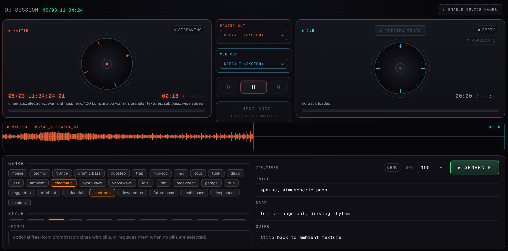

# Generative DJ



An open-source live AI DJ desktop app. Generates instrumental tracks via [Suno V5.5](https://suno.com/) (through the [kie.ai](https://kie.ai/) API), then mixes them in real time with phrase-aligned auto-DJ transitions and dual-output audio routing — master to your speakers, cue to your headphones, like a hardware DJ controller in software.

Built on **Next.js + Web Audio API + Electron**. The auto-DJ engine runs entirely client-side: beat tracking (Ellis 2007), Foote novelty structural segmentation, and energy-curve drop detection are implemented as a Web Worker that decodes the audio in-browser.

## What it does

- Generate Suno V5.5 instrumental tracks from a styled prompt (genre / mood / elements pills + structural intro/drop/outro presets) on demand.
- Pre-buffer the next track on a shadow audio channel so transitions are zero-gap.
- Detect beats, downbeats, and 16-bar phrase boundaries on each track.
- Auto-transition on a phrase boundary in the master, dropping into the cue at *its* first detected drop.
- Route master and cue to **separate output devices** via `setSinkId` (Chrome / Edge / Electron only).
- Toggle between Suno's two variants of any generation with a single click.

## What it isn't (yet)

This repo is the **engine prototype** — a working dual-deck AI DJ tool with proper auto-DJ algorithms. It is not a finished consumer product. There is no stream-event integration, no track library / cache, no semantic conversation reactivity. Those layers are the natural follow-ups but are not in this repository.

## Requirements

- **Node 22 LTS** (or newer)
- A **kie.ai API key** for the Suno V5.5 generation backend — sign up at [kie.ai/api-key](https://kie.ai/api-key)
- **Chrome, Edge, or Electron** (i.e., a Chromium-based environment) for the dual-output audio routing to work — Safari and Firefox have only partial `setSinkId` support

## Quickstart (browser, dev)

```bash
git clone https://github.com/rainierrubin/generative-dj.git
cd generative-dj
npm install

# Set your kie.ai API key
cp .env.example .env.local
# edit .env.local and paste your KIE_API_KEY

npm run dev
# open http://localhost:3000 in Chrome
```

## Quickstart (Electron desktop app)

```bash
# in the project directory, after npm install:
cp .env.example .env.local      # paste your KIE_API_KEY
npm run build                   # builds the Next.js standalone server
npm run electron:start          # launches the Electron desktop window
```

For a faster dev loop:

```bash
# terminal 1
npm run dev
# terminal 2
npm run electron:dev            # opens Electron pointing at the dev server
```

## Architecture

```
┌──────────────────────────────────────────────────────────────┐
│ Electron BrowserWindow                                       │
│  ┌────────────────────────────────────────────────────────┐  │
│  │ Next.js renderer (React 19)                            │  │
│  │  - Two-deck DJ UI (master + cue)                       │  │
│  │  - Pill prompt builder (genre / mood / elements)       │  │
│  │  - Auto-DJ engine (Web Worker, FFT, beat tracking)     │  │
│  └──────────────────────┬─────────────────────────────────┘  │
│                         │ IPC fetch                          │
│  ┌──────────────────────▼─────────────────────────────────┐  │
│  │ Next.js API routes (server-side, in same process)      │  │
│  │  - /api/generate  → kie.ai POST /api/v1/generate       │  │
│  │  - /api/status    → kie.ai GET  /record-info           │  │
│  │  - /api/audio/stream → CORS-clean proxy for Web Audio  │  │
│  └────────────────────────────────────────────────────────┘  │
└──────────────────────────────────────────────────────────────┘
                          │
                          ▼
                 ┌──────────────────┐
                 │  api.kie.ai      │
                 │  (Suno V5_5)     │
                 └──────────────────┘
```

The Electron main process (`electron/main.cjs`) spawns the Next.js standalone server as a child process on a local port, then opens a BrowserWindow loading it. The kie.ai API key is read from `.env.local` and injected into the child server's environment — never embedded in the renderer bundle.

### Auto-DJ engine

The `src/workers/analysis-worker.ts` file implements:

- **Spectral-flux onset envelope** with log-magnitude STFT and moving-median post-processing
- **Autocorrelation tempo estimation** in 60–200 BPM with a mild prior
- **Ellis 2007 dynamic-programming beat tracker** (onset score + log-spaced tempo regularity penalty)
- **Sub-bass downbeat phase detection** assuming 4/4
- **Bar-pooled MFCC** (40 mel filters → log → DCT-II)
- **Cosine self-similarity matrix + Foote checkerboard novelty** for structural segmentation
- **Section labelling** from per-bar RMS deltas (`intro / build / drop / main / breakdown / outro`)

`src/lib/transition-planner.ts` picks transition cuts: 16-bar phrase boundaries first, then 8-bar, then 4-bar, weighted by energy delta and tempo distance. Cue starts at its first detected `main` or `drop` section.

## License

MIT — see [LICENSE](./LICENSE).

## Acknowledgements

- [Suno](https://suno.com/) for the V5.5 generation model
- [kie.ai](https://kie.ai/) for the API access
- D. P. W. Ellis, "Beat tracking by dynamic programming," *Journal of New Music Research*, 2007
- J. Foote, "Visualizing music and audio using self-similarity," *ACM Multimedia*, 1999
- [fft.js](https://github.com/indutny/fft.js) for the FFT primitive
